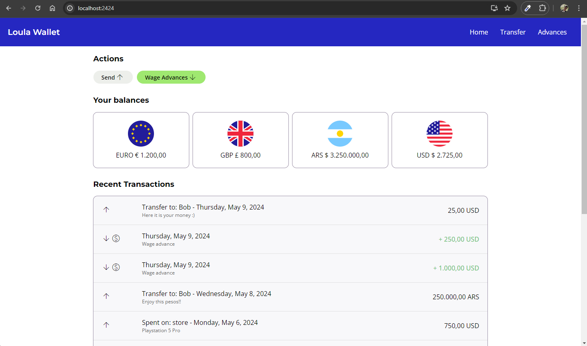
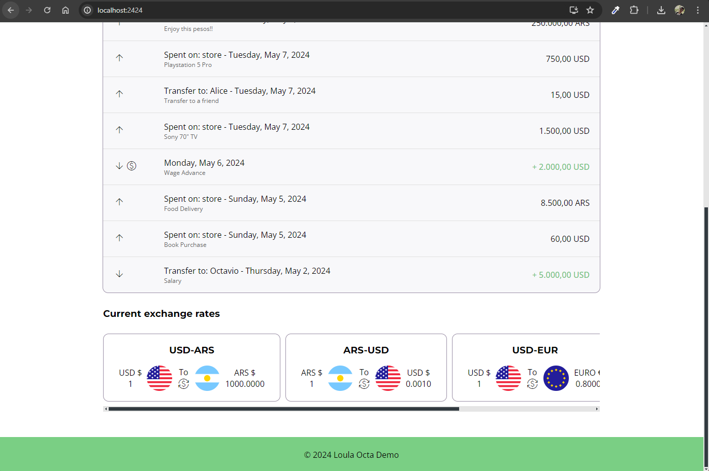
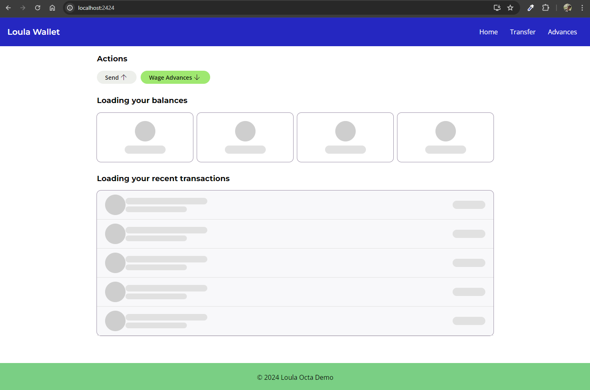
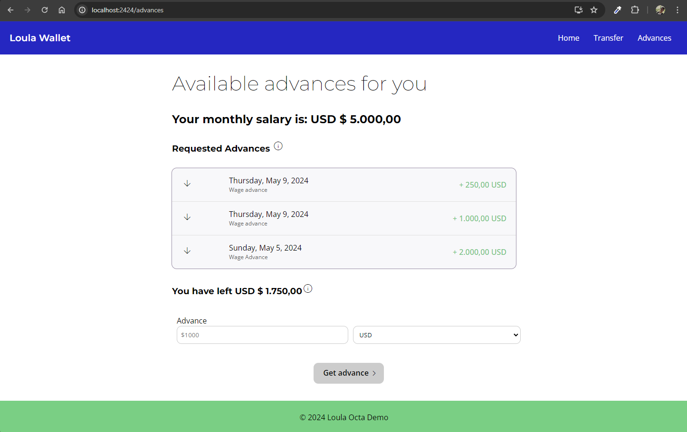
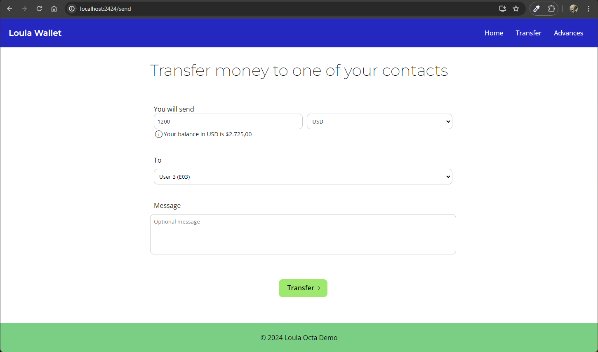
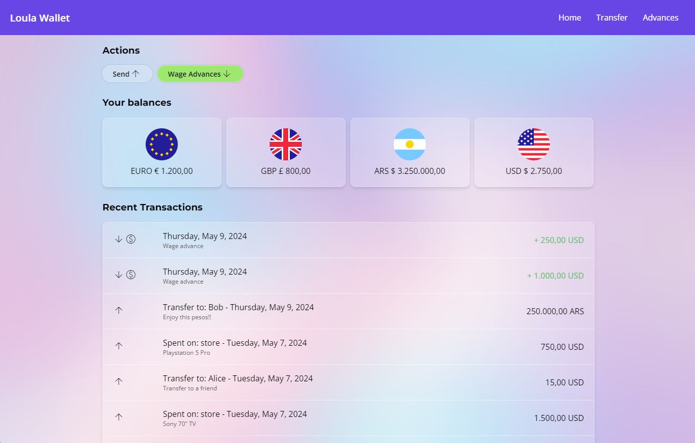
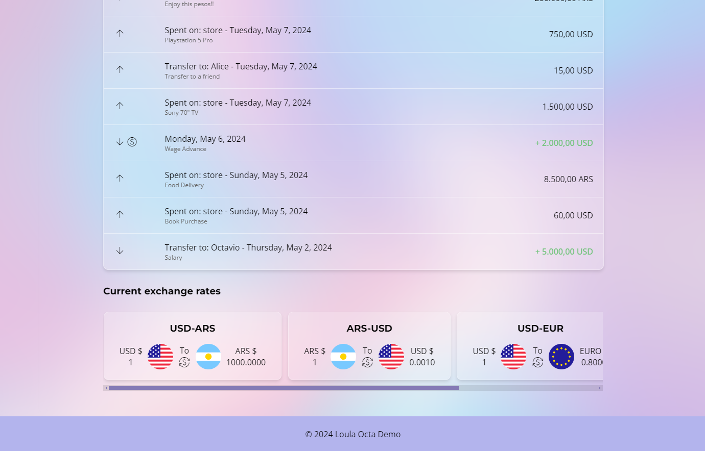

# Loula Wage Access coding challenge

### Index

1. [About](#about)
2. [Frontend](#frontend)
3. [Backend](#backend)
4. [Database](#database)
5. [How to run](#how-to-run)
6. [Screenshots](#screenshots)

### About

The Loula Wage Access coding challenge aims to create a simple wage access platform allowing employees to request early access to their earned wages. This platform enables employees to request an advance of their salary within a specified range, enhancing financial flexibility and control.

The main idea is that, if an employee earns X amount of money per month, it can ask for an advance of Y amount of money, if Y is a number in the range [0, X]. For example, if the employee earns 5000 usd a month, then he/she can ask for an advance of up to 5000 usd that will be paid next month when he/she gets paid their salary. It could ask for 1000, 3000, or 5000, but not more than that.

In this wallet application, you can keep track of your balances, in all your currencies, and ask for advances depending on the currency you earn your salary monthly. As an extra step, I implemented the functionality to allow the user make transfers to other employees, and to spend money on things that are outside the wallet (for example a shop).

### Frontend

The frontend is build in React, using as low libraries as possible.

It only depends on axios, and react-router, nothing else.

The app is divided in 3 main screens:

1. Home screen: Where you can see your balances, and all your transactions.
2. Wage Advance screen: Where you can ask for an advance of your salary.
3. Transfer Money screen: Where you can transfer money to other employees.

### Backend

The backend is build in Node.js, using Express.js.

The api consists of these endpoints:

1. GET `/employee/general/:employeeId`: To get the general information of an employee (name, total earning, monthly salary, and salary currency).
2. GET `/employee/balance/:employeeId`: To get the balance of an employee in all the currencies that employee has.
3. GET `/employee/transactions/:employeeId`: To get a list of all the transactions of an employee.
4. GET `/advance/avaliable/:employeeId`: To get the maximum amount of money an employee can ask for an advance, taking into account the amount of money that employee has already asked for this month.
5. POST `/advance/requested`: Returns a list of all the advancements the employee has asked for this month.
6. POST `/advance/request`: To ask for an advance of the salary.
7. POST `/transactions/transfer`: To make a transfer of money from one employee to another.
8. POST `/transactions/spend`: To spend money on something that is not in the wallet.

### Database

The database is implemented in PostgreSQL, and it has 4 main tables:

1. Employees: To store the general information of the employees.

| id | name | total_earning | monthly_salary | salary_currency |
|----|------|---------------|----------------|-----------------|
| E01  | Octavio | 15,000          | 5,000           | USD             |
| E02  | Alice | 3,000          | 3,000           | EUR             |
| E03  | Bob | 4,500,000          | 2,000,000           | ARS             |
...

2. Employee Balances: To store the balances of the employees in all the currencies they have.

| balance_id | employee_id | currency | balance |
|------------|-------------|----------|---------|
| B01        | E01         | USD      | 2,725   |
| B02        | E01         | EUR      | 1,200   |
| B03        | E01         | EUR      |   800   |
| B05        | E02         | ARS      | 500,000 |
...

3. Transactions: To store all the transactions of the employees, including advances, transfers, and spends outside the wallet.

| transaction_id | employee_id | type | amount | currency | description | transaction_date | recipient_id | vendor |
|----------------|-------------|------|--------|----------|-------------|------------------|--------------|--------|
| 1              | E01         | wage_advance | 1000 | USD      | Wage advance | 2024-05-05 | NULL | NULL |
| 2             | E01         | transfer | 500 | USD      | Transfer to Alice | 2024-05-06 | E02 | NULL |
| 3             | E01         | spend | 100 | USD      | Spend on groceries | 2024-05-07 | NULL | Store |
| 4             | E02         | wage_advance | 500 | EUR      | Wage advance | 2024-05-07 | NULL | NULL |
...

4. Currency Rates: To store the currency rates of the day.

| id | pair | rate |
|----|------|------|
| 1  | USD-EUR | 0.85 |
| 2  | EUR-USD | 1.18 |
| 3  | USD-ARS | 1000 |
| 4  | ARS-USD | 0.001 |
...

These tables are populated with sample data when the docker-compose is run for the first time. This data is stored in the `src/database/init.sql` file.

### Setup

To run the app, you need to have Docker installed.

Clone the repo:

```
git clone https://github.com/octaviotastico/loula-wage-access
```

Then, go to the `/src` directory:

```
cd loula-wage-access/src
```

Run the docker-compose command:

```
docker compose -f ./docker/docker-compose.yml up --build
```

**Important Note**: Your terminal has to be in the `/src` directory.


If instead of using Docker, you were to run the app locally instead, you would need to have a PostgreSQL database running, and run the `init.sql` file to create the needed database, tables, and populate them.

I added the .env on purpose, so anyone can run this easily.

For the frontend, you would need to run:

```
cd src/app-frontend
npm install
npm start
```

And for the backend:

```
cd src/app-backend
npm install
npm start
```

### Screenshots

#### Home screen top



#### Home screen bottom



#### Home screen loading



#### Wage Advance screen



#### Transfer Money screen



### There's also a different design for the home screen in the glassmorphism-test branch

Top:


Bottom:


### TODOs and improvements for the future

- Add a login screen with SSO, and a way to register new employees.
- Add the possibility to add new employees as contacts, to make transfers.
- Add more features to the wallet, like the possibility to add a new currency, and to exchange money between them.
- Update the currency rates daily, and store them in the database.
- Mage get transactions endpoint to have a limit and offset, to avoid getting all the transactions at once.